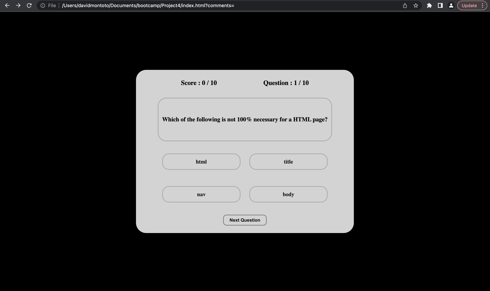
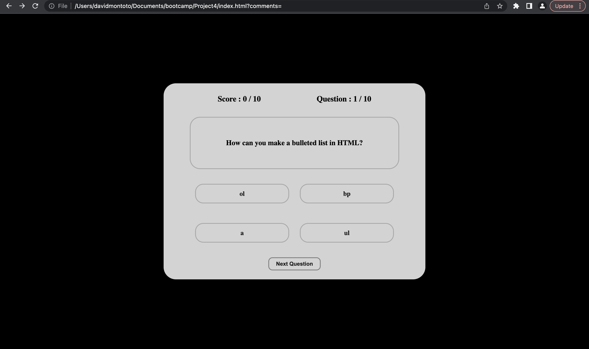
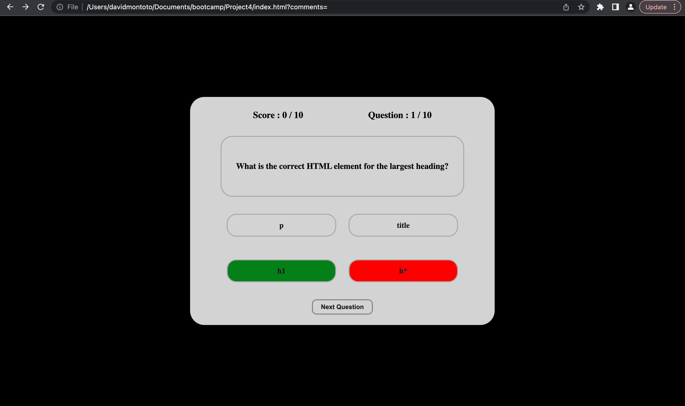

<h1>Basic HTML Quiz</h1>	

What better way to test yourself on HTML than to quiz yourself on the material through a HTML website? The link attached below will take you to my HTML basic knowledge quiz. Through using javascript, alongside simple css, this basic quiz website can be formed. 

[HTML Quiz]( "HTML Quiz").

In order for the questions to be generated in random orders everytime, the questions are objects within the javascript file. By keeping every question, along with the options and correct answer as individual objects, we can generate random indexes in this array of "question" objects and display them on screen in this unique order. 

Through additional css, an active display can be created to give the user responses based on whether the option selected was correct or wrong. This simple idea can help a user understand the material in a more adaptive setting. 

